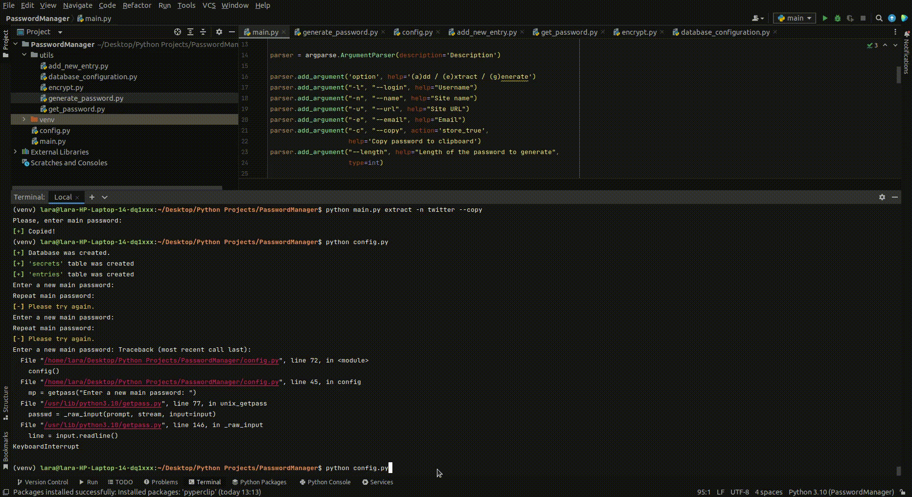

# Python Password Manager
Command line interface python password encryptor, generator and manager.

## General Outline

The program takes a main password and uses it to securly store and access any other password (and respective username and site), so the user only needs to remember one password. It can also automatically copy any stored password to the clipboard and generate random passwords using alphabet, numbers and special characters. The stored passwords are encrypted before being saved and decrypted when being retrieved.

## Implementation

### Configuration of password database (mySQL)

- User enters main password that gets hashed and saved.
- Program generates device secret
- Hashing function takes device secret and main password to create a main key
- Main key is used for encryption and decryption

### Adding new password

- User enters the site for which the new password will be stored
- Before entering new password to store, user needs to enter main password
- Program hashes entered password and compares to existing hashed main password to validate
- User then enters new password that gets encrypted and saved to the database with the rest of the fields using the main key

### Fetching already saved password

- User enters the information of the password to retrieve
- Program displays the matching data
- User can choose to get a password copied to clipboard
- User enters main password that gets validated
- Password to retrieved gets decrypted and copied

